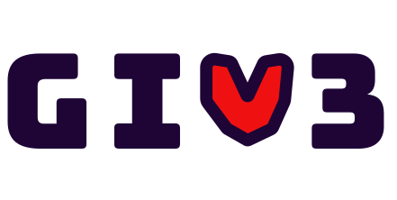

# Giv3rs

</a>

🖌️ UI/UX Design: <https://www.figma.com/file/5DzSlzB3mI3MrTST9zRMLN/Morpheus-Hackathon>

🖥️ Frontend: <https://github.com/Giv3rs/giv3-interface>

💡 Backend: <https://github.com/Giv3rs/giv3-core>

## 📑 Deck

## Technical Architecture

